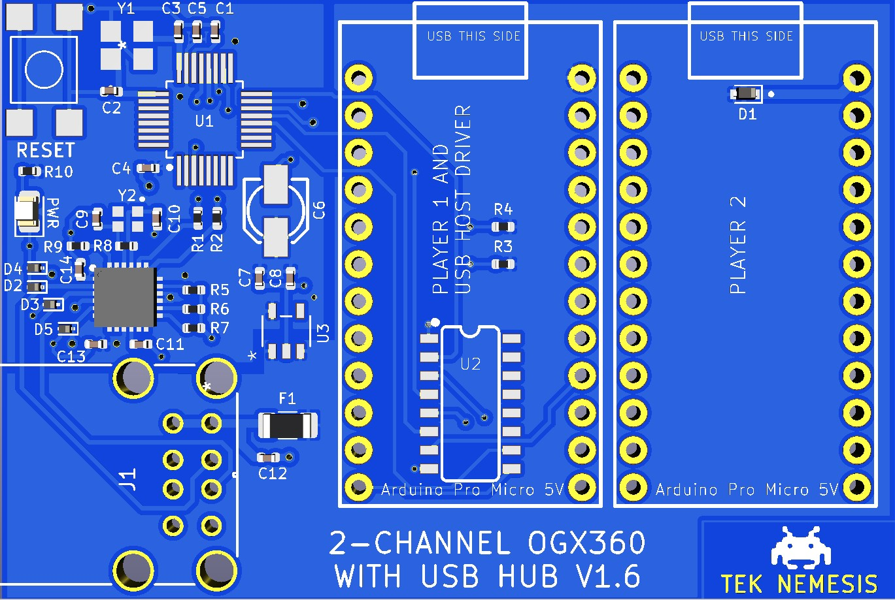

# Hardware

## Overview

For the most part, the OGX360s keep the same hardware and this version simply adds the components for the USB hub.  This design uses mostly 0402 sized components in order to keep the PCB size to a minimum.  

 

### Part Sourcing

The majority of these parts can be purchased from Digikey however, at the time of writing this README, some stock was depleted there. 

* **USB2422-I/MJ**: https://www.aliexpress.com/wholesale?catId=0&initiative_id=SB_20210612110915&SearchText=USB2422-I%2FMJ
* **Arduino Pro Micro 5V**:  I prefer using the black ones with the large ATMEGA32U4-AU but the blue ones will work fine as well (though the Micro USB port on the blue ones isn't as robust so you should re-inforce them with extra solder on the sides and then with 2-part epoxy on the sides and back).  Any 5V version (including clones) of the Arduino Pro Micro will do.  https://www.aliexpress.com/wholesale?catId=0&initiative_id=SB_20210612112316&SearchText=arduino+pro+micro+5V
* **Custom Xbox to Micro USB cables** may be purchased through The Mod Shop by TEK Nemesis: 
  * https://www.facebook.com/groups/TheMODShopByTEK 
  * https://www.facebook.com/TheModShopByTEK

### Assembly Notes

**IMPORTANT**:  Ensure to bridge the J1 points (with solder) on each Arduino Pro Micro 5V.  This will bypass the Arduino's voltage regulator and provide enough "juice" to safely run the ogx360 without the requirement of an external power source.

 

* The TVS Diodes are for ESD protection.  They are optional but are highly recommended as the USB Hub Controller is highly sensitive to ESD damage.  

