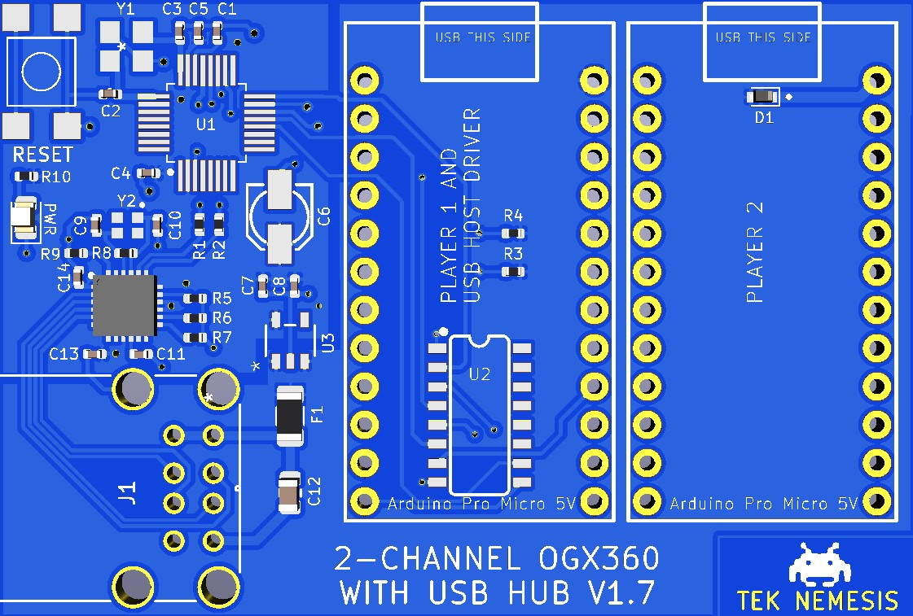

# Hardware

## Overview

For the most part, the OGX360s keep the same hardware and this version simply adds the components for the USB hub.  Version 1.7 is a little easier to assemble than the version 2.0.

## Version 1.7:

 

 

## Version 2.0:

 

 

## Part Sourcing

The majority of these parts can be purchased from Digikey however, at the time of writing this README, some stock was depleted there. 

* **USB2422-I/MJ**: https://www.aliexpress.com/wholesale?catId=0&initiative_id=SB_20210612110915&SearchText=USB2422-I%2FMJ
* **Arduino Pro Micro 5V**:  I prefer using the black ones with the large ATMEGA32U4-AU but the blue ones will work fine as well (though the Micro USB port on the blue ones isn't as robust so you should re-inforce them with extra solder on the sides and then with 2-part epoxy on the sides and back).  Any 5V version (including clones) of the Arduino Pro Micro will do.  https://www.aliexpress.com/wholesale?catId=0&initiative_id=SB_20210612112316&SearchText=arduino+pro+micro+5V

### Version 1.7 Assembly Notes

**IMPORTANT**:  Ensure to bridge the J1 points (with solder) on each Arduino Pro Micro 5V.  This will bypass the Arduino's voltage regulator and provide enough "juice" to safely run the ogx360 without the requirement of an external power source.

 

* The TVS Diodes are soldered on the bottom of the PCB.  They are optional but are highly recommended as the USB Hub Controller is highly sensitive to ESD damage.  

